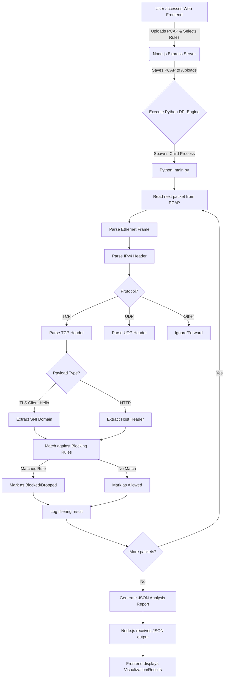

# DPI Engine - Deep Packet Inspection Analyzer Documentation

## 1. Problem Statement
Traditional firewalls typically operate at the transport layer (Layer 4), filtering traffic based purely on IP addresses and port numbers. While effective for basic networking, this approach struggles in modern environments where multiple applications (e.g., YouTube, Facebook, WhatsApp) all share the same standard ports (like TCP 443 for HTTPS). 

Administrators face the challenge of blocking specific services that utilize encrypted transport tunnels without breaking other legitimate traffic, a process made difficult by modern TLS/SSL encryption. Standard IP-based blocking is an ineffective game of "whack-a-mole" due to dynamic CDNs and cloud hosting environments constantly changing the underlying IPs of these services.

## 2. Solution
This **Deep Packet Inspection (DPI) Engine** inspects the payload portion of network packets traversing the network. Instead of just looking at IP and Port combinations, the engine dives into the Application Layer (Layer 7). 

By passively dissecting network traffic, it identifies metadata *before* the encrypted tunnel is fully established:
- **TLS Client Hello Parsing**: Natively extracts the **Server Name Indication (SNI)** field, revealing the true requested domain (e.g., `youtube.com`) even though the subsequent payload will be encrypted.
- **HTTP Header Parsing**: Extracts the standard `Host` HTTP header for unencrypted traffic.
- **DNS Parsing**: Analyzes standard DNS requests.

This allows the engine to accurately identity the application layer protocol and apply rule-based filtering (Domain, Application Name, or IP) to drop unwanted packets and allow authorized traffic, presenting the results locally via a Node.js web dashboard.

---

## 3. Project Architecture

The project utilizes a decoupled architecture split into two main components:
1. **Core DPI Engine (Backend Data Processor)**: Written in Python 3, this engine is responsible for the heavy lifting. It ingests raw network packets (from [.pcap](file:///d:/Packet_analyzer-main/Packet_analyzer-main/test_dpi.pcap) files), parses the internal protocols (Ethernet, IPv4, TCP, UDP) completely from scratch, performs deep inspection (SNI, HTTP), and filters the traffic based on provided rules.
2. **Web Dashboard (Frontend UI Layer)**: A Node.js and Express server that presents a graphical interface to the user. It allows users to upload network captures, select blocking rules through a clean UI, executes the Python engine in the background, and displays the filtering results.

---

## 4. Flowchart (Analysis Workflow)



---

## 5. Project Structure

```text
packet_analyzer/
├── frontend/                  # Web Interface (Presentation Layer)
│   ├── public/                # Static UI assets served to the browser
│   │   ├── index.html         # Main dashboard markup
│   │   ├── style.css          # UI styling
│   │   └── app.js             # UI logic, API fetching, and chart rendering
│   ├── uploads/               # Temporary storage for uploaded PCAP files
│   ├── server.js              # Node.js backend to handle API routing and Python execution
│   └── package.json           # Node.js dependencies
│
├── packet_analyzer_py/        # Python DPI Engine (Core Logic Layer)
│   ├── core/                  # Core parsing modules
│   │   ├── packet_parser.py   # Implementation of Layer 2/3/4 protocols (Eth/IP/TCP/UDP)
│   │   ├── pcap_reader.py     # Binary parsing of the standard PCAP file format
│   │   ├── rule_manager.py    # Logic to evaluate packets against user-defined rules
│   │   ├── sni_extractor.py   # Application layer (L7) parsers for TLS SNI and HTTP Host
│   │   └── types.py           # Data structures, Enums, and 5-Tuple stream tracking
│   │
│   └── main.py                # Command Line Interface (CLI) application entry point
│
├── test_dpi.pcap              # Sample network traffic file containing varied L7 protocols
└── generate_test_pcap.py      # Simulation script to cleanly generate synthetic network flows
```

---

## 6. Detailed Project Explanation

### Python DPI Engine (`packet_analyzer_py`)
Unlike systems that rely on external C-bindings like `libpcap`, this engine processes raw binary directly using Python's standard `struct` module. 
- **`pcap_reader.py`**: Reads the global PCAP file header (identifying endianness and link-type) and iteratively unpacks the timestamps and raw bytes of individual packet headers.
- **`packet_parser.py`**: Takes the raw bytes and slices them into protocol fields. For example, it extracts the Source/Destination MAC from the first 14 bytes (Ethernet), extracts IPs from the IPv4 header, and identifies the transport layer protocol (TCP/UDP).
- **`sni_extractor.py`**: This is the "Deep" part of the DPI. It looks specifically for the signature of a TLS `Client Hello` handshake. By navigating through the TLS Record, Handshake Protocol, and TLS Extensions, it isolates the `Server Name Indication` string, effectively identifying the web service being accessed despite the encryption.
- **Stateful Analysis**: The engine associates individual packets into flows (using the standard 5-Tuple: Source IP, Dest IP, Source Port, Dest Port, Protocol) to maintain context over a continuous streaming session.

### Node.js Frontend (`frontend`)
- **`server.js`**: Exposes a RESTful POST endpoint (`/api/analyze`). When a multi-part form payload (PCAP file + array of blocking rules) hits this endpoint, it writes the file to disk and uses standard Node.js `child_process.exec` to run `python main.py <file> <rules>`. It captures the standard output of the Python execution, parses it as JSON, and returns it to the client.
- **`app.js` & `index.html`**: The static frontend provides an intuitive way for a user to interact with the system without needing command-line knowledge. It visualizes the JSON report generated by the backend, detailing how many packets were inspected, stripped, or validated.
